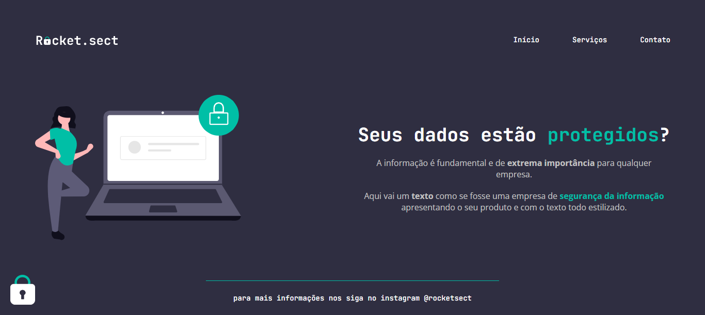

Eae, Dev! 👊🏾

Seja bem vindo(a) ✨🚀

<h1 align="center">Rocket.sect</h1>
<h3 align="center">Trilha Explorer - Rocketseat</h3>

  <a href="#-sobre">Sobre</a>&nbsp;&nbsp;&nbsp;|&nbsp;&nbsp;&nbsp;
  <a href="#-tecnologias">Tecnologias</a>&nbsp;&nbsp;&nbsp;|&nbsp;&nbsp;&nbsp;
  <a href="#-layout">Layout</a>&nbsp;&nbsp;&nbsp;|&nbsp;&nbsp;&nbsp;
  <a href="#-licença">Licença</a>&nbsp;&nbsp;&nbsp;|&nbsp;&nbsp;&nbsp;
  <a href="#-acesse-o-explorer">Acesse o Explorer</a>

  

<h3>📌 Sobre</h3>

O projeto Rocket.sect é o desafio prático da trilha Explorer da Rocketseat, cujo objetivo é reproduzir um layout utilizando os conceitos básicos de HTML e CSS.

<h3>📌 Tecnologias</h3>

- HTML, CSS;
- Git;
- Figma;

<h3>📌 Layout</h3>

Você pode visualizar o layout do projeto através [DESSE LINK](https://www.figma.com/file/EdKjPWjC8ZlbnH4XzTObv2/Explorer/duplicate). É necessário ter conta no [Figma](https://figma.com) para acessá-lo.

<h3>📌 Licença</h3>

Esse projeto está sob a licença MIT.

<h3>📌 Acesse o Explorer</h3>

[Explorer](https://rocketforms.typeform.com/to/fPcSmBp9#referral_id=41c0c597-0d85-46fd-a3dd-f559cacad623)